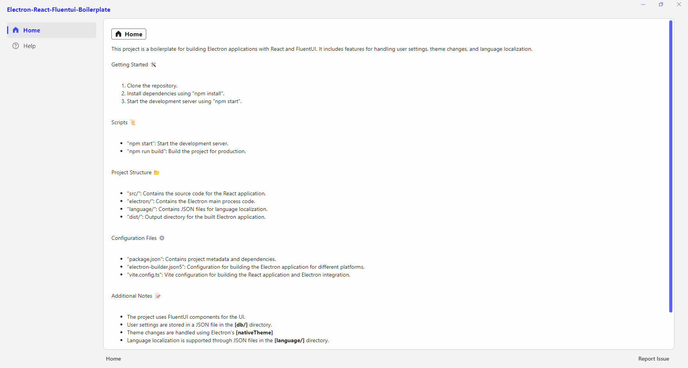

# Electron-React-FluentUI Boilerplate 🚀

A boilerplate for building Electron apps with React and Fluent UI, featuring user settings and theme management.

## Preview

## Getting Started 🛠️

1. Clone the repository.
2. Run `npm install`.
3. Start the server with `npm start`.

## Building the Application 🏗️

1. Complete the "Getting Started" steps.
2. Build for your platform:
   - Windows: `npm run build:win`
   - macOS: `npm run build:mac`
   - Linux: `npm run build:linux`
3. Find the built app in the `release/` directory.

## Project Structure 📂

- `src/`: Source code for the React app.
- `electron/`: Electron main process code.
- `release/`: Built Electron app output.

## Configuration Files ⚙️

- `package.json`: Project metadata and dependencies.
- `electron-builder.json5`: Build configuration for platforms.
- `vite.config.ts`: Vite config for React and Electron.

## Additional Notes 📝

- Uses [FluentUI](https://react.fluentui.dev) components.
- Theme changes via Electron's [nativeTheme].

## Developer 👨‍💻

Created by [Burak Ünal](https://linktr.ee/burakunal28)
